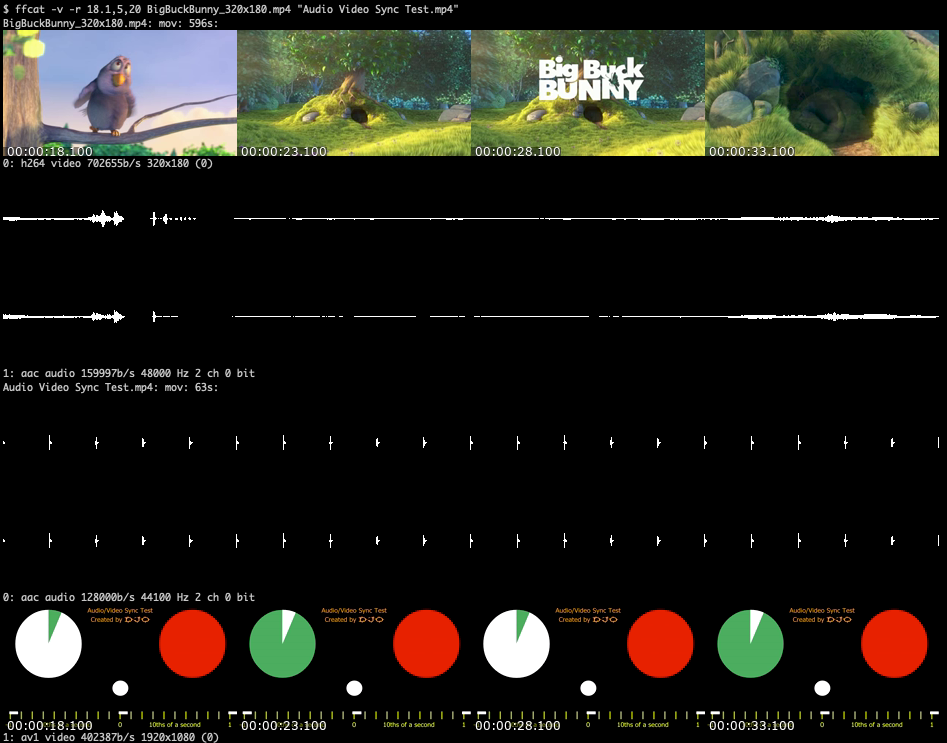

# ffcat

Output file preview directly in terminal. Currently can only output via iTerm2 control codes.

**WARNING: This is a quick proof of concept hack**

## Supports

- Video by showing frames
- Audio by showing wave form
- Images
- SVG
- Graphviz





## Requirements

Make sure you have a reasonably modern ffmpeg, inkscape, rsvg and graphviz in `$PATH`.

## Install

```
# build and install latest master
GOPROXY=direct go install github.com/wader/ffcat@master
# copy binary to $PATH if needed
cp "$(go env GOPATH)/bin/ffcat" /usr/local/bin
```

## Tricks

### Use with watchexec etc
```
watchexec -- "... | ffcat -c"
```

`-c` makes iTerm2 clear the buffer to not run out of memory, same as `echo -e '\x1b]1337;ClearScrollback\x07'`.

### Plot using gnuplot
```
# format is whitespace separated x y values
echo -e "1 3\n2 4\ne\n" | gnuplot -e "set terminal png; plot '-' using 1:2 w l" | ffcat
```

### Show PDF page

```
pdftocairo -f 1 file.pdf -png -singlefile - | ffcat
```

## TODO and ideas

- Ok to use stderr to talk to iterm2? seem to work, makes it possible to pipe
- iterm2 clean buffer argument?
- Rename? is not really concatinating
- Combine wave form and spectragram?
- Silent/verbose output
- Pipe input, have to buffer?
- Timeline grid
- Seek from end support. -20: etc?
- Stats, loudness etc?
- Proper seek and frame select
- Select frames syntax?
- Render subtitles?
- Sixel output
- ANSI output
- PNG output if not a terminal
